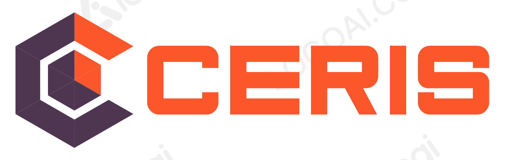

<a name="readme-top"></a>


[](https://github.com/eblaas/ceris/blob/main/LICENSE)
[![LinkedIn][linkedin-shield]][linkedin-url]


<!-- PROJECT LOGO -->
<br />
<div align="center">
  <a href="https://github.com/eblaas/ceris">
    
  </a>

<h3 align="center">Ceris Integration Runtime</h3>

  <p align="center">
    Open-source data integration runtime that helps you consolidate your data
    <br />
    <a href="https://eblaas.github.io/ceris/"><strong>Explore the docs »</strong></a>
    <br />
    <br />
    <a href="https://github.com/eblaas/ceris/issues">Report Bug</a>
    ·
    <a href="https://github.com/eblaas/ceris/issues">Request Feature</a>
  </p>
</div>


<!-- TABLE OF CONTENTS -->
<details>
  <summary>Table of Contents</summary>
  <ol>
    <li>
      <a href="#about-the-project">About The Project</a>
      <ul>
        <li><a href="#built-with">Built With</a></li>
      </ul>
    </li>
    <li>
      <a href="#getting-started">Getting Started</a>
      <ul>
        <li><a href="#installation">Installation</a></li>
      </ul>
    </li>
    <li><a href="#usage">Usage</a></li>
    <li><a href="#roadmap">Roadmap</a></li>
    <li><a href="#development">Development</a></li>
    <li><a href="#contributing">Contributing</a></li>
    <li><a href="#license">License</a></li>
    <li><a href="#contact">Contact</a></li>
    <li><a href="#acknowledgments">Acknowledgments</a></li>
  </ol>
</details>


<!-- ABOUT THE PROJECT -->
## About The Project

[![Product Name Screen Shot][product-screenshot]]()

Ceris is an open-source data integration runtime that helps you consolidate your data in your data lake.
Ceris provides a comprehensive UI for managing connectors and is based on Kafka Connect &copy; .

####Features:
* single jar
* embedded kafka server, no cluster setup required
* install 150+ connectors from Confluent Hub&copy;
* Extract & Load data from different sources to sinks
* Database replication
* Changed Data Capture CDC
* Cloud migration


### Built With

* [![Kafka][Kafka]][Kafka-url]
* [![Vue][Vue.js]][Vue-url]
* [![Vuetify][Vuetify]][Vuetify-url]


<!-- GETTING STARTED -->
## Getting Started

This is an example of how you can run ceris locally with some simple demo connectors.

### Installation
Ceris runs on
* java
* or docker

1. Download the latest [release](https://github.com/eblaas/ceris/releases)
2. Run jar
   ```sh
   java -jar ceris-x.x.x.jar -Dceris.demo
   ```
3. Or run with docker
   ```sh
   docker run --name ceris -p 4567:4567 -e CERIS_DEMO=true eblaas/ceris
   ```
4. Login Ceris UI [http://localhost:4567](http://localhost:4567) (admin:admin)
 

<p align="right">(<a href="#readme-top">back to top</a>)</p>


<!-- USAGE EXAMPLES -->
## Usage

For more examples, please refer to the [examples](examples)


<!-- ROADMAP -->
## Roadmap

- Enhanced Monitoring


See the [open issues](https://github.com/eblaas/ceris/issues) for a full list of proposed features (and known issues).


### Development

Develop locally
* Run UI in develop mode [http://localhost:4000](http://localhost:4000)
  ```sh
  cd ceris-ui
  npm install
  npm run serve
  ```
* Run backend
  ```sh
  cd ceris-agent
  ./mvnw clean package exec:java -DskipTests
  ```

<!-- CONTRIBUTING -->
## Contributing


Contributions are what make the open source community such an amazing place to learn, inspire, and create. Any contributions you make are **greatly appreciated**.

If you have a suggestion that would make this better, please fork the repo and create a pull request. You can also simply open an issue with the tag "enhancement".
Don't forget to give the project a star! Thanks again!

1. Fork the Project
2. Create your Feature Branch (`git checkout -b feature/AmazingFeature`)
3. Commit your Changes (`git commit -m 'Add some AmazingFeature'`)
4. Push to the Branch (`git push origin feature/AmazingFeature`)
5. Open a Pull Request

<p align="right">(<a href="#readme-top">back to top</a>)</p>


## License

Distributed under the Apache License 2. See [LICENSE](LICENSE) for more information.


## Contact

Profile: [https://github.com/eblaas](https://github.com/eblaas)


<!-- ACKNOWLEDGMENTS -->
## Acknowledgments

* [Kafka](https://kafka.apache.org/)
* [Confluent](https://www.confluent.io/)
* [Lenses](https://lenses.io/)

<p align="right">(<a href="#readme-top">back to top</a>)</p>

[linkedin-shield]: https://img.shields.io/badge/-LinkedIn-black.svg?logo=linkedin&colorB=555
[linkedin-url]: https://linkedin.com/in/ernst-blaas-678306238
[product-screenshot]: docs/docs/img/ceris-screen.png
[Kafka]: https://img.shields.io/badge/Kafka%20Connect-000000?style=flat-square&logo=apachekafka&logoColor=white
[kafka-url]: http://kafka.apache.org/documentation/#connect
[Vue.js]: https://img.shields.io/badge/Vue.js-000000?style=flat-square&logo=vuedotjs&logoColor=4FC08D
[Vue-url]: https://vuejs.org/
[Vuetify]: https://img.shields.io/badge/Vuetify-000000?style=flat-square&logo=vuetify&logoColor=4FC08D
[Vuetify-url]: https://vuetifyjs.com/
