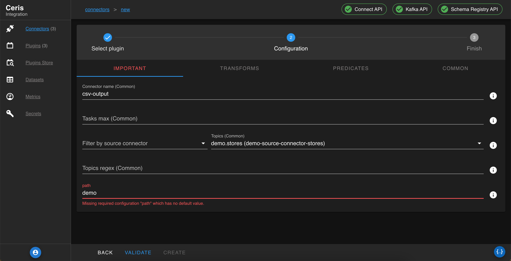

# Ceris Integration Runtime

Ceris is an open-source data integration runtime that helps you consolidate your data in your data lake.
Ceris provides a comprehensive UI for managing connectors and is based on Kafka Connect&copy;.

##Features
* single jar
* embedded kafka server, no cluster setup required
* install 150+ connectors from Confluent Hub&copy;
* Extract & Load data from different sources to sinks
* Database replication
* Changed Data Capture CDC
* Cloud migration

##Requirements
* java 17+ or
* docker